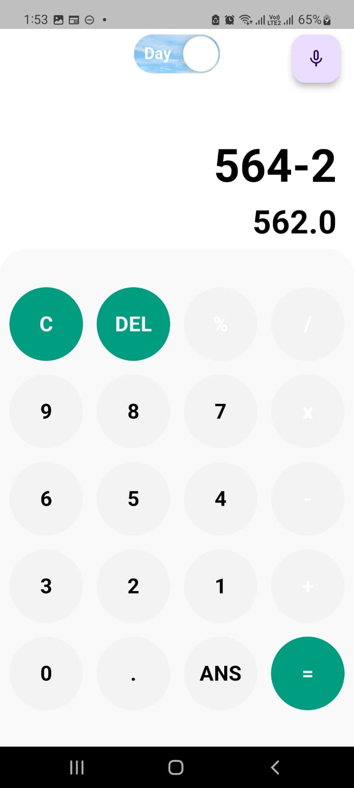
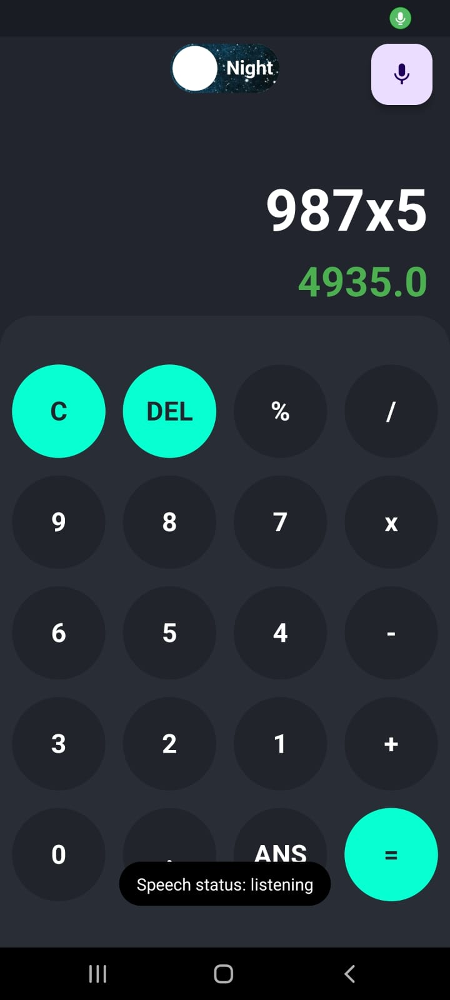
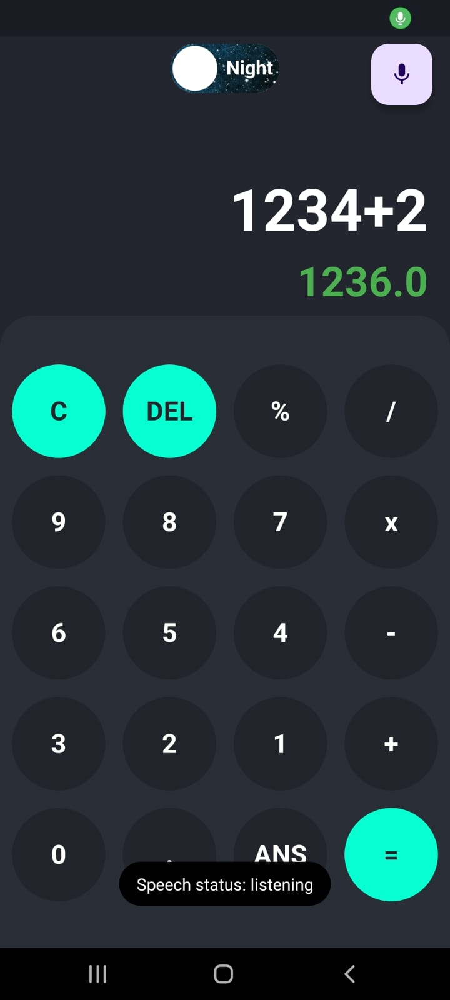

# calculator

A new Flutter project.

## App Screenshots

Here are some screenshots of the app:

<table>
  <tr>
    <td style="padding: 10px;"></td>
     <tr>
    <td colspan="2" style="width: 40px;"></td> <!-- Empty row for vertical space -->
  </tr>
    <td style="padding: 10px;"></td>    
  </tr>
  <tr>
    <td colspan="2" style="height: 40px;"></td> <!-- Empty row for vertical space -->
  </tr>
  <tr>
    <td style="padding: 10px;"></td>
     <tr>
    <td colspan="2" style="width: 40px;"></td> <!-- Empty row for vertical space -->
  </tr>
    <td style="padding: 10px;"></td>
  </tr>
  <tr>
    <td colspan="2" style="height: 20px;"></td> <!-- Empty row for vertical space -->
  </tr>
</table>
